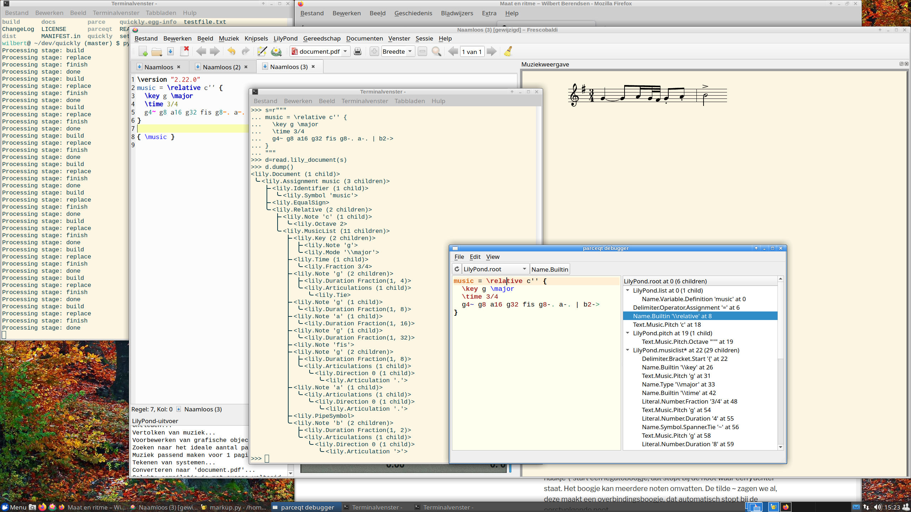

.. include:: ../../README.rst

   A screenshot of Frescobaldi (which does not yet use *quickly*), the
   *parceqt* debugger and a terminal window showing a dump of the *quickly* DOM
   tree of a small piece of music.

This manual documents `quickly` version |release|.
Last update: |today|.

.. toctree::
   :maxdepth: 2
   :caption: Contents:

   quicklydom.rst
   modoverview.rst

Indices and tables
==================

* :ref:`genindex`
* :ref:`modindex`
* :doc:`changelog`
* :doc:`license`
